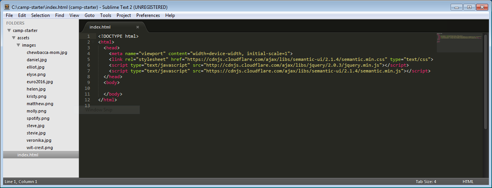
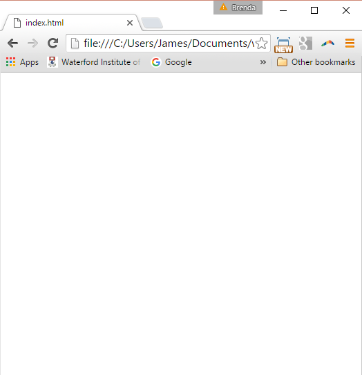

# The Tools

## Editor

Visit this site:

- <https://www.sublimetext.com/>

And download and install the Sublime text editor.

## Starter Project

Download this archive here:

 - [camp-starter.zip](archives/camp-starter.zip)

Expand the archive (you may be able to do this just by double clicking on it).

## Setting up the work environment

Once the project above is ex expanded - launch the Sublime text editor, and drag & drop the folder containing the expanded project onto the sublime text editor window. Your work space should look like this:

Now, locate the 'index.html' file in the archive an open it in a web browser:

You are now ready to go on to the next step...