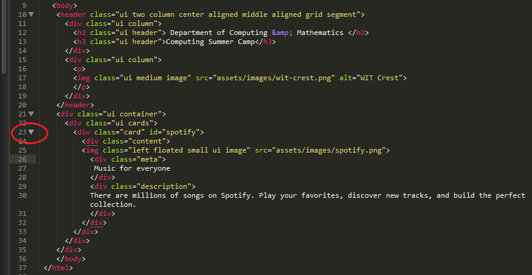
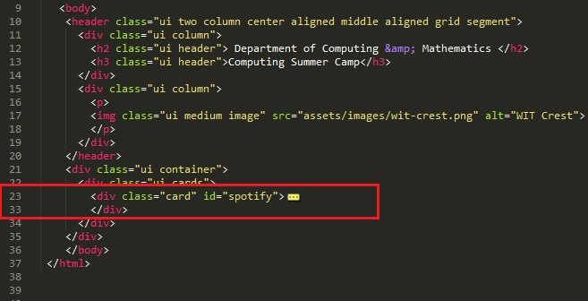
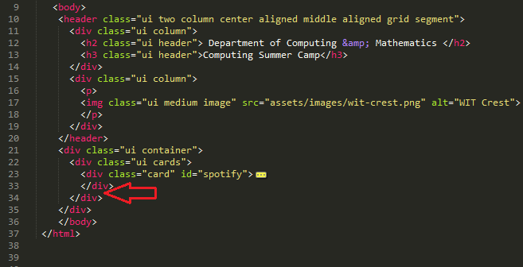
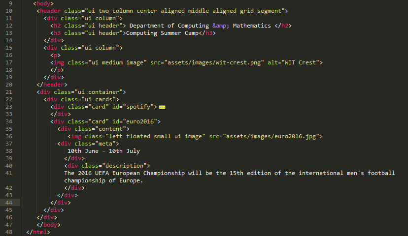
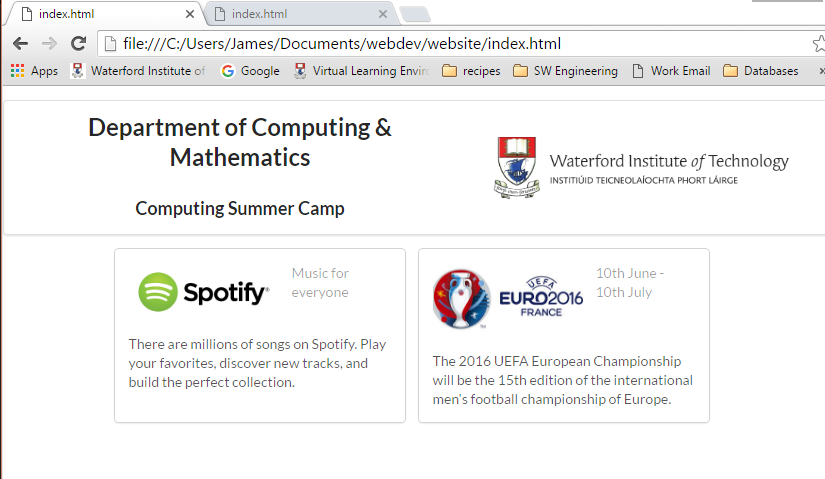
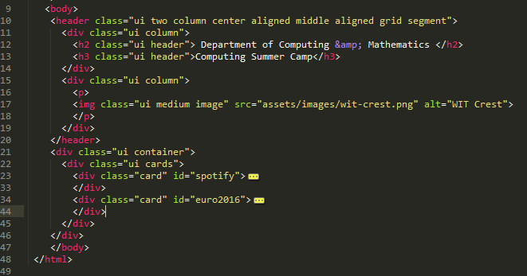
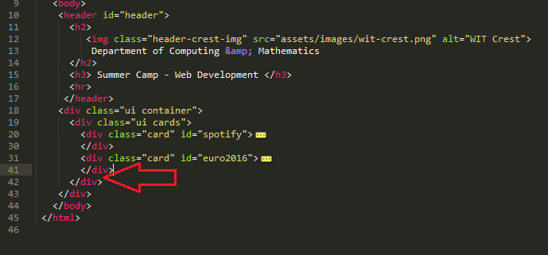
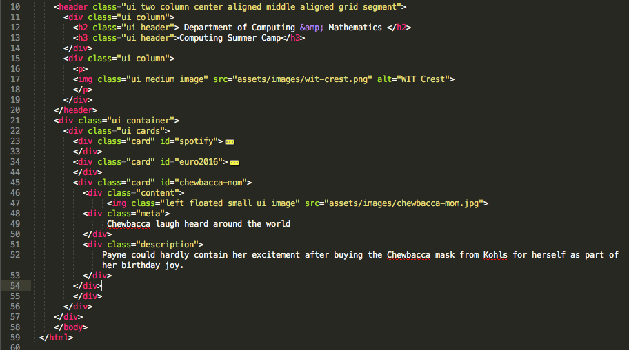
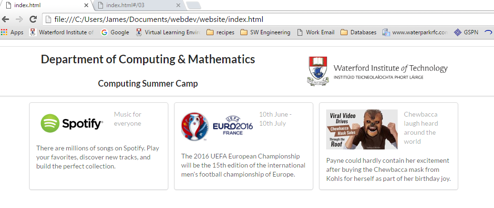

#Adding content

Now we have created one piece of content we can copy it and make two more pieces of content.
First we need to be able to view our code in smaller parts. We do this by hiding some parts of the code and showing other parts. 

- In the Sublime text editor move your mouse near the number 23 (this is the line number). It must be the line that contains the code `
 . You should see a small downwards facing arrow appearing beside the number. 
- Click on this arrow.

- Once the arrow is clicked all of the code for the spotify content is hidden and it looks like this:

- This makes is easier to read a large file of code. We will be now adding more code and this technique is helpful for viewing sections of code.

- Copy this section of code

~~~
        

          

             
          

             10th June - 10th July
          

          

            The 2016 UEFA European Championship will be the 15th edition of the international men's football championship of Europe.
          

          

        

~~~

- Go to the Sublime text editor and paste the section of code directly after the `</div`> for the spotify section as shown below:

- If you are happy your code now looks like this:

- Choose save from the file menu
- Go to the Chrome web browser and click the refresh button.

- We now have two pieces of content, one for spotify and one for the European Cup.
- We will add one more piece of content to complete the web page content.
- First hide the section of code that relates to the euro2016 piece of content, you do this by clicking on the downwards arrow beside number 34 (the line of code containing `
. Your code will now look like this:

- Copy this piece of code

~~~
        

          

             
          

             Chewbacca laugh heard around the world
            

            

            Payne could hardly contain her excitement after buying the Chewbacca mask from Kohls for herself as part of her birthday joy.
            

          

        

~~~

- Go to Sublime text editor and paste the piece of code directly after the `</div`> for the euro2016 section, as shown below:

- Your code should now look like this:

- Choose Save from the File menu if your code is correct.
- Go to Chrome web browser and click refresh.

- You should now see three pieces of content
- Scroll back up to the top of this page and click on the next step in this lab (link is in the top bar of this web page).

