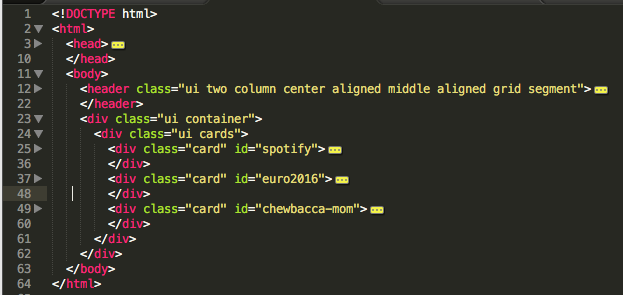
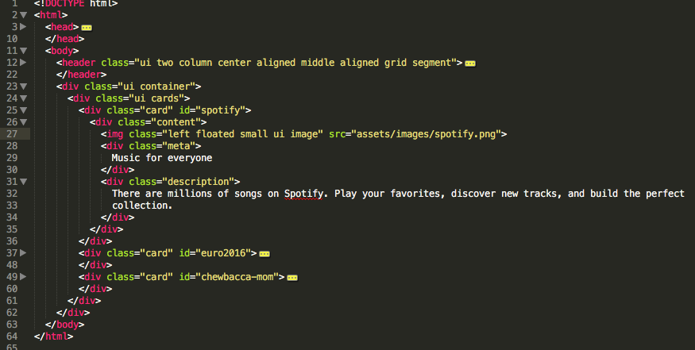
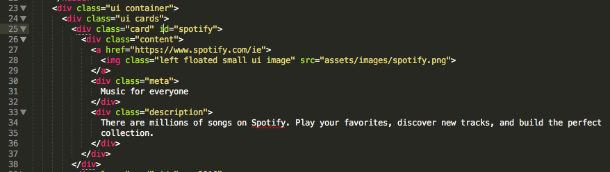

#More Cards

Our complete web page `source` should now be like this:

~~~
<!DOCTYPE html>
<html>
  <head>
    <meta name="viewport" content="width=device-width, initial-scale=1">
    <link rel="stylesheet" href="https://cdnjs.cloudflare.com/ajax/libs/semantic-ui/2.1.4/semantic.min.css"
          type="text/css">
    
    
  </head>
  <body>
    <header class="ui two column center aligned middle aligned grid segment">
      

        <h2 class="ui header"> Department of Computing &amp; Mathematics </h2>
        <h3 class="ui header">Computing Summer Camp</h3>
      

      

        

          
        

      

    </header>
    

      

        

          

            
            

              Music for everyone
            

            

              There are millions of songs on Spotify. Play your favorites, discover new tracks, and build the perfect
              collection.
            

          

        

        

          

            
            

              10th June - 10th July
            

            

              The 2016 UEFA European Championship will be the 15th edition of the international men's football
              championship of Europe.
            

          

        

        

          

            
            

              Chewbacca laugh heard around the world
            

            

              Payne could hardly contain her excitement after buying the Chewbacca mask from Kohls for herself as part
              of her birthday joy.
            

          

        

      

    

  </body>
</html>
~~~

If yours isn't quite the same, you can replace your version with the above - just copy/paste everything above, replacing your version completely.

Because the file is so long, it can get confusing to manage. Try `collapsing` the various sections by pressing the little triangle/arrows in the margin on the left. See if you can get the editor to look like this:

Now we can just `zoom in` on each card if we want to make some changes - say to the first card:

Let's make the spotify image a link, so it goes to the spotify page if we click on it. This is the tag we want to edit - make sure you can find it:

~~~
            
~~~

Now, replace the above tag with this version:

~~~
            
~~~

Make sure you keep the tags lined up in an `indented` pattern so it looks like this:

Refresh the pages in your browser now - see if the spotify link is active - i.e. clicking on it takes you the spotify web site.

##Challenge!

Using the above as a guide - see if you can link up the images in the other two cards to these links here:

- <http://www.uefa.com/uefaeuro>

- <https://www.youtube.com/watch?v=hyp90txeNxM>

