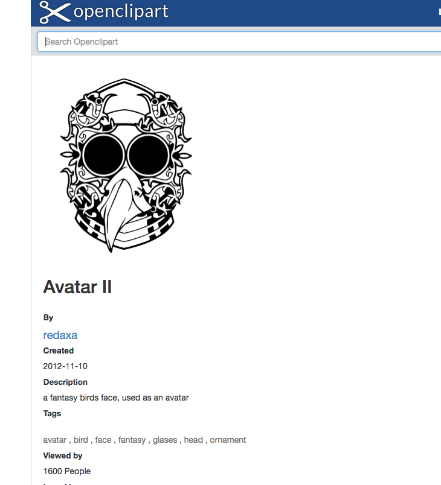
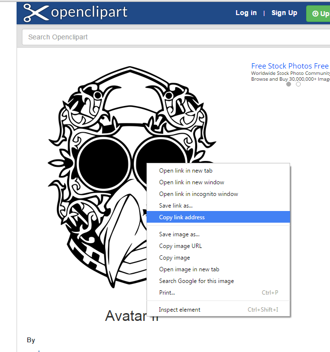

#More Cards

Here is another example of a card

  

    

      
    

    

      
Matt Sullivan

      

        <a>Friends</a>
      

      

        Matthew is a computing student at WIT.
      

    

  

And this is the source:

~~~
        

          

            
          

          

            
Matt Sullivan

            

              <a>Friends</a>
            

            

              Matthew is a computing student at WIT.
            

          

        

~~~

Make a few cards using this template and put them on your page. There are some other avatar images in your assets folder you can link to with these names:

- daniel.png
- kristy.png
- elyse.png
- helen.png
- kristy.png
- stevie.png
- veronika.png

Just change the image link from `assets/images/matthew.png` to  `assets/images/kristy.png` or whatever. Create a few cards now, use your own name or make up some names - and write some short summary text (about yourself?).

##Linking to Images from the Web

You can also create a card that links directly to an image on the web. Here is a link to some online avatar images:

- [Avatar Images](https://openclipart.org/search/?query=avatars)

Find one you like - and click on it:

Then, select an image and press the `right` mouse button. Select `Copy image address`...

Now, in a card you are creating, try pasting the the address you just copied into the image link. It might start to look like this when you paste it in:

~~~
          

            
          

~~~

The card will look like this in the browser:

 

   

     
   

   

     
Matt Sullivan

     

       <a>Friends</a>
     

     

       Matthew is a computing student at WIT.
     

   

 

Fish out a few more images from here:

- [Avatar Images](https://openclipart.org/search/?query=avatars)

and create some more cards.

