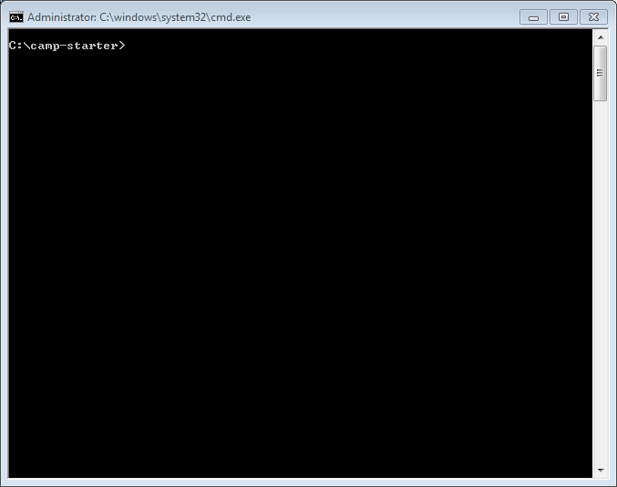

# Tools

Visit this site here:

- <https://nodejs.org/en/>

Download and install the "LTS" version of node.

Now visit this site:

- <https://harpjs.com/>

And see of you can install the harp package. On windows. the install can be carried out by entering the following commands in the command prompt:

~~~
npm install -g harp
~~~

If this works, then set your command prompt to the folder containing your camp-starter project:

See step 07 for simple commands to 'move' around the folder structure on your PC.

You should now be able to go on to the next step.