#Toolkit

You have been building a page using this toolkit here:

- <http://semantic-ui.com/>

This is a library of web components - and you can pick and choose from many different types of component (scroll down to see some examples). If you click on the `menu` button on the top left:

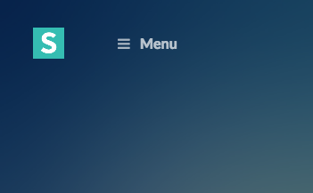

Then it will reveal a palette of interesting components:

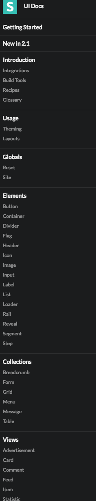

You have been using the `card` - at the very end of the list above. Click on `card` in the list, and you will see a basic card:

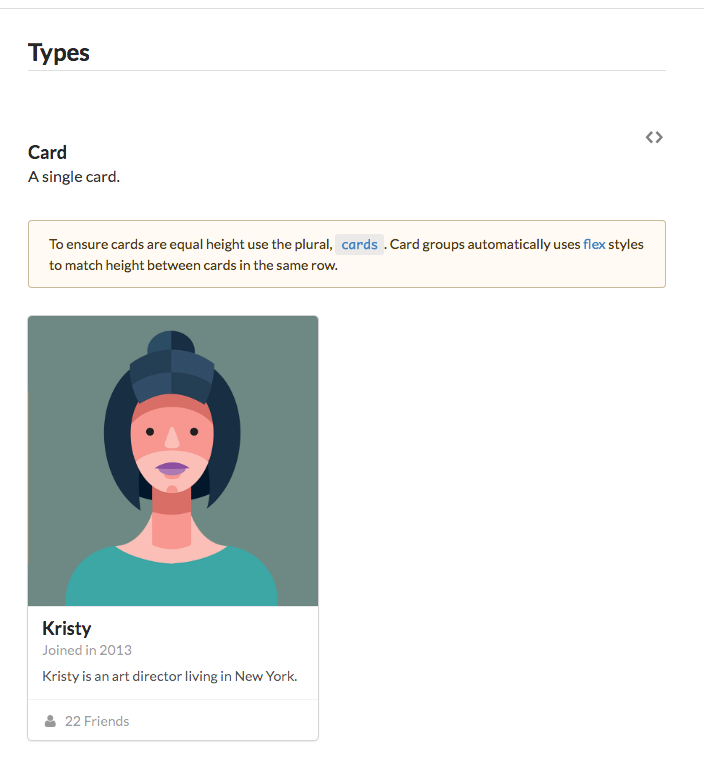

Here is the interesting part - click on the `<>` symbols on the top right - and the codes needed to display a card are revealed:

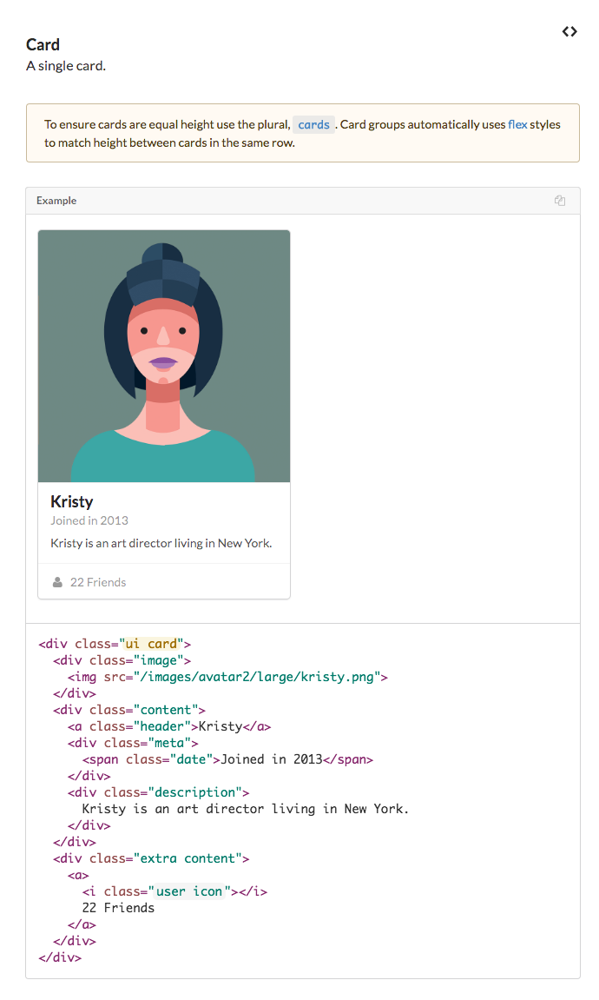

If you copy and paste the revealed code:

~~~

  

    
  

  

    <a class="header">Kristy</a>
    

      Joined in 2013
    

    

      Kristy is an art director living in New York.
    

  

  

    <a>
      <i class="user icon"></i>
      22 Friends
    </a>
  

~~~

..into your page you get the card:

  

    
  

  

    <a class="header">Kristy</a>
    

      Joined in 2013
    

    

      Kristy is an art director living in New York.
    

  

  

    <a>
      <i class="user icon"></i>
      22 Friends
    </a>
  

(The image will not work initaly - but dont worry about this).

Hunt around among the other components and see what you can make work. Remember, you need to press the `<>` link to get the code, then past the code into your page, save the file, and refresh the page to see it in action. For example, have a look at:

- [Buttons](http://semantic-ui.com/elements/button.html)
- [Labels](http://semantic-ui.com/elements/label.html)
- [Lists](http://semantic-ui.com/elements/list.html)
- [Comments](http://semantic-ui.com/views/comment.html)
- [Statistic](http://semantic-ui.com/views/statistic.html)
- [Progress](http://semantic-ui.com/modules/progress.html)

See of you can make some of these, or any others ones, work.

##Example - Button

For instance if you visit this page:

- <http://semantic-ui.com/elements/button.html>

Scroll down a bit and you see some interesting buttons:

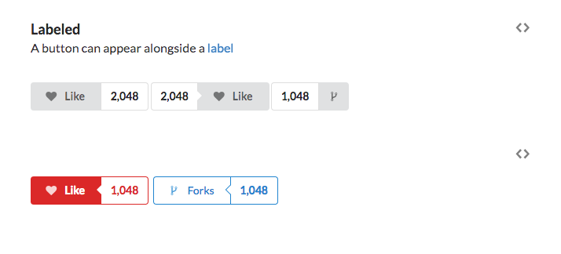

Press `<>` to reveal the code:

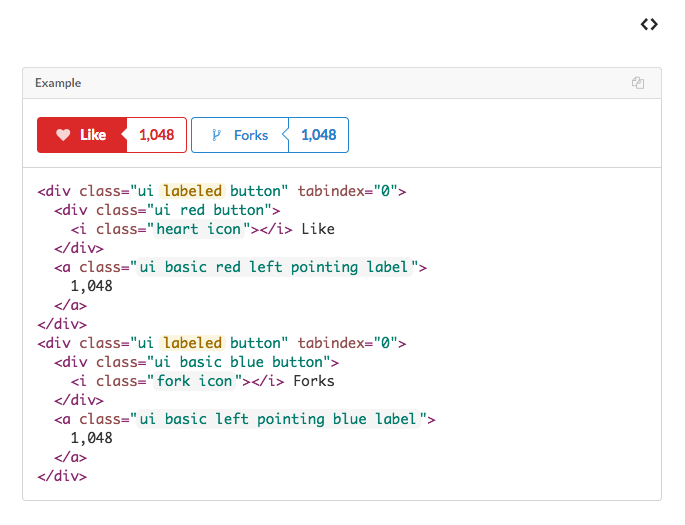

Copy/paste the first button into your page - perhaps inside a card - you can get this effect:

  

    
  

  

    <a class="header">Kristy</a>
    

      Joined in 2013
    

    

      Kristy is an art director living in New York.
    

  

  

  

    <i class="heart icon"></i> Like
  

  <a class="ui basic red left pointing label">
    1,048
  </a>

  

##Icons

- Lets try adding instagram and facebook icons to one of the cards.

- Semantic contains icons in the Elements section.

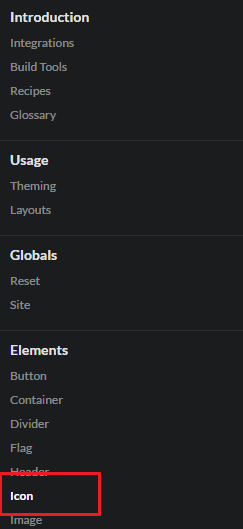

- We will add the following code to the Uefa Euro Championship 2016 card.

~~~
        

            <a href="https://www.facebook.com/uefachampionsleague/?fref=ts">
              <i class="facebook square icon large"></i>
            </a>
            <a href="https://www.instagram.com/uefaeuro/?hl=en">
              <i class="instagram icon large"></i>
            </a>
            <a href="https://www.pinterest.com/maferqui/uefa-champions-league/?etslf=8517&eq=uefa">
              <i class="pinterest icon large"></i>
            </a>
        

~~~     

- Copy the code, in Sublime you need to place this section of code directly after the description `</div`>

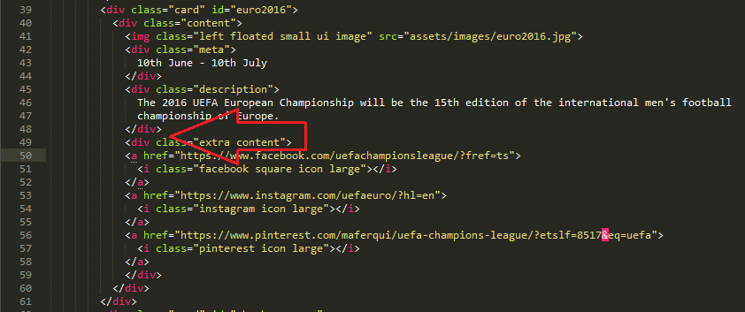

- Save in the Sublime editor and refresh the Chrome browser to see the results locally.
- It should show like this:

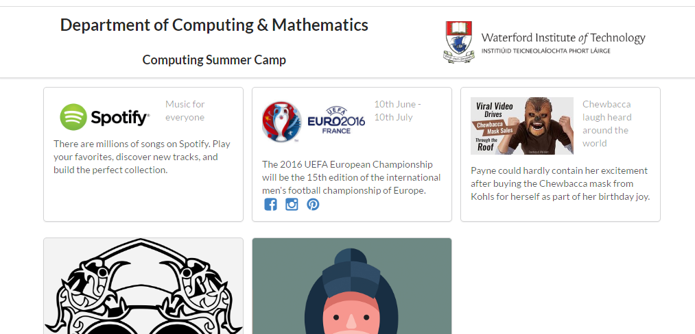

- click on the icons to see that they bring you to the correct pages.

## Share button 

- Now we will try adding a share button to Matt's card.
- Copy this code

~~~
 

            <iframe src="https://www.facebook.com/plugins/share_button.php?href=https%3A%2F%2Fwww.facebook.com%2Fwitcomp%2Fposts%2F1014124925340048&layout=button&mobile_iframe=true&width=57&height=20&appId" width="57" height="20" style="border:none;overflow:hidden" scrolling="no" frameborder="0" allowTransparency="true"></iframe>
          

~~~

- In Sublime editor paste the code into the card for Matt. It needs to go just before the `</div`> as shown below:

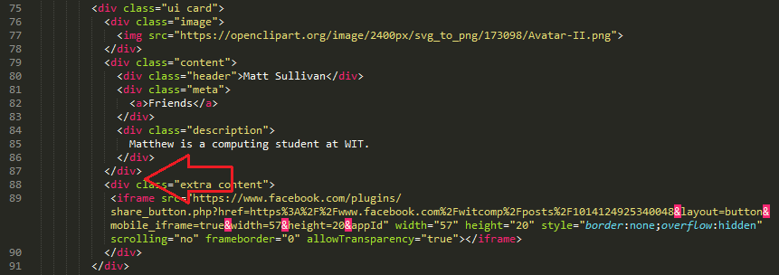

- Save in Sublime
- Refresh the Chrome web page.

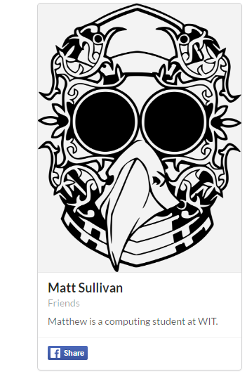

- At this stage you could push your changes to your hosted website. To do this you go to the black command screen window and as you did before you type the following:

~~~
surge 
~~~

- Remember you can change the domain so it stays the same as before or you can use the new one. 
- Now refresh the Chrome page for the hosted website and test out the share button ( you will have to login to Facebook to do this). 

Go and explore some more components!

