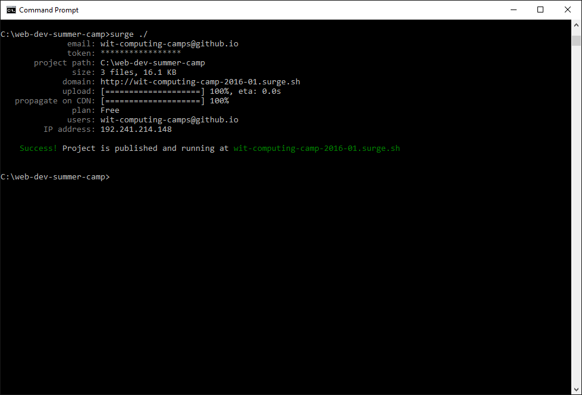

#Publishing the web site

Somewhere on our desktop you should have a `Command Prompt` windows looking something like this:

Select this window, and enter the following `command` :

~~~
surge ./
~~~

When you press return, then the command prompt will look like this:

The very last line will may have a different number at the end. This simple command has published your site to the web. Take the link and paste it into the address bar of your browser.

- <http://wit-computing-camp-2016-01.surge.sh>

(it might be a different number at the end).

This link is now public! Ask your neighbour to look at your link and give him/her yours. Try different last 2 digits (up to 25) to see what everyone else is up to!

##Challenge

See if you can create a card with an image that, when you click on it, visits your neighbours page - or any other page in the class.